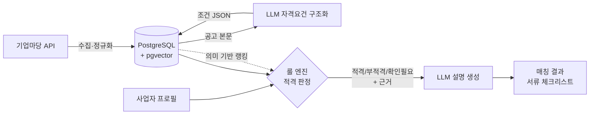

# 자금나침반 (FundCompass)

> **소상공인·창업기업을 위한 AI 정책자금 매칭 서비스**
> 정책자금을 *검색*해주는 서비스가 아니라, **받을 수 있는지 판정**해주는 서비스.

🔗 https://fundcompass-kr.vercel.app · 2026 금융 AI Challenge 출품작

---

## 왜 만드는가

2026년 정부는 소상공인 정책자금 **3조 3,620억 원**, 창업지원사업 **3조 2,940억 원**을 편성했다. 지원을 받은 소상공인의 87.5%가 "실제로 도움이 됐다"고 답한다. 정책의 품질은 문제가 아니다.

문제는 **도달**이다.

- 창업지원사업만 **101개 기관 / 429개 사업**에 흩어져 있다
- 기업마당에 등록되는 공고는 **연간 3만 건 이상**
- 그 결과 최근 3년간 디지털·AI 지원사업 참여율은 **3.2%**, 미참여 사유 1위는 **"그런 사업이 있는지 몰랐다" (76.2%)**

<sub>출처: 중소기업중앙회 「소상공인 DX·AX 현황 및 정책 수요 조사」(2026.6, 소상공인 500개사) — 해당 조사는 디지털·AI 분야 지원사업 기준</sub>

즉 예산의 문제가 아니라 **탐색과 판단의 문제**다.

---

## 기존 서비스와 무엇이 다른가

기업마당, 보조금24, 민간 포털 모두 **검색**을 제공한다. 조건을 필터링해 목록을 보여주고, **자격 판단은 사용자에게 되돌려준다.** 가장 앞선 공공 서비스인 보조금24조차 이렇게 고지한다.

> "조회되는 보조금이 곧 수급 자격을 의미하지는 않습니다."

```
기존:  조건 필터 → [공고 목록]        → "읽고 알아서 판단하세요"
본 서비스: 사업자 프로필 → [적격 판정] → "받을 수 있습니다 / 없습니다 / 확인 필요"
                                        + 근거 + 서류 체크리스트
```

| | 기존 | 자금나침반 |
|---|---|---|
| 입력 | 사용자가 필터를 선택 | 사업자 프로필 (업력·업종·지역·매출·고용) |
| 출력 | 공고 목록 | **적격 / 부적격 / 확인필요** |
| 근거 | 없음 | 충족·미충족 조건을 항목별로 명시 |
| 부적격 처리 | 침묵 | *"업력 6개월 부족 → 3개월 뒤 신청 가능"* |

---

## 아키텍처



### 설계 원칙: LLM은 판정하지 않는다

> **룰 엔진이 결정하고, LLM은 설명한다.**

금융 서비스에서 "받을 수 있다"는 판단이 환각으로 흔들리면 안 된다. 그래서 판정 책임을 명확히 분리했다.

| 계층 | 역할 | 왜 |
|---|---|---|
| **① 정형 자격 필터** | 업력·매출·업종·지역·고용을 결정론적으로 평가 | 판정 근거가 코드로 추적·재현 가능하다 |
| **② 의미 기반 랭킹** | pgvector 임베딩 유사도 | 자연어로 표현된 사업 니즈를 공고와 연결 |
| **③ LLM 설명** | 근거 서술, 서류 체크리스트, 절차 안내 | 사용자가 실제로 행동할 수 있게 |

판정 결과는 **2분류가 아니라 3분류**다. 공고에는 *"사업성이 우수한 자"*처럼 기계가 판단할 수 없는 조건이 반드시 섞인다. 이를 적격/부적격으로 밀어넣으면 틀린 답이 나온다. **모른다고 말할 수 있는 것**이 신뢰의 조건이라고 봤다.

---

## 기술 스택

| 영역 | 선택 | 선택 이유 |
|---|---|---|
| 백엔드 | Spring Boot 4.1 · Java 21 | Virtual Thread 기반 외부 API 병렬 수집 |
| AI | Spring AI 2.0 · Claude API | Spring 생태계 내 일관된 아키텍처 (2.0.x가 Boot 4 지원 라인) |
| DB | PostgreSQL 17 + pgvector | 벡터 검색을 별도 인프라 없이 단일 DB로 해결 |
| 프론트엔드 | Next.js | |
| 배포 | AWS (백엔드) · Vercel (프론트엔드) | |
```

---

<sub>2026 금융 AI Challenge · 주최 금융보안원 · 후원 금융위원회</sub>
